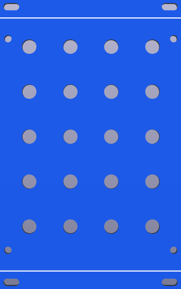
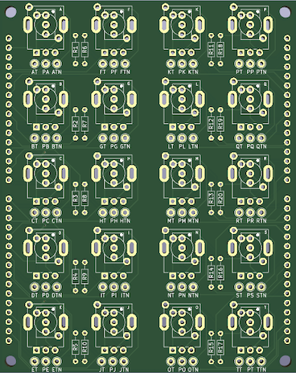
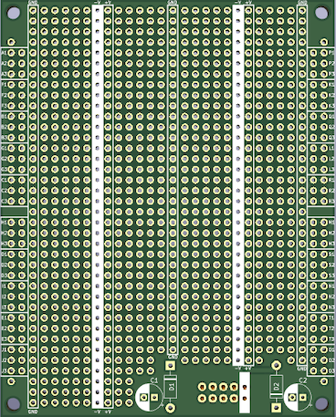
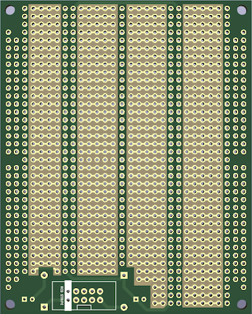

EURORACK PROTOBOARD 16HP
========================

A universal Eurorack module building system inspired by [Serge Modular Paperface](https://serge-modular.com/paperface),
and Delptronics [Module Construction Set](https://delptronics.com/module-construction-set.php).

All projects in the [DIY-Nabra](https://github.com/DIY-Nabra) repositories are built using this board, or it's little
sibling the [10hp Eurorack Protoboard](https://github.com/DIY-Nabra/EuroProto-10hp)

Licensed under a CC BY-NC-SA 4.0 (Creative Commons Attribution-NonCommercial-ShareAlike 4.0) license.  See the [License File](./LICENSE.md) for more details.

*Front panel*

*Panel components board*

*Front of mainboard*

*Back of mainboard*

